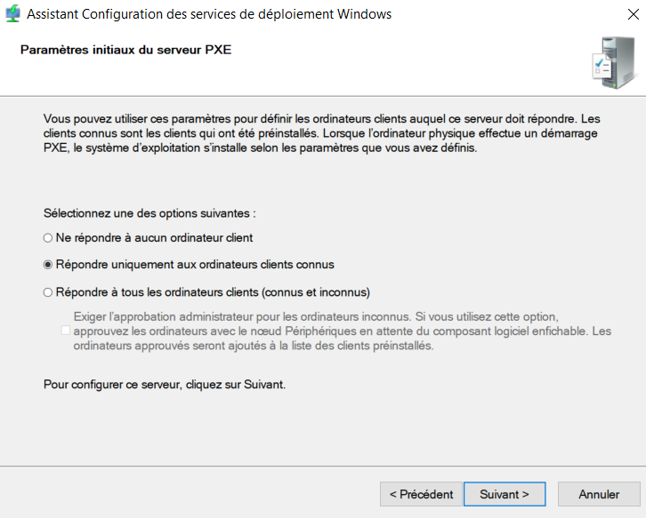
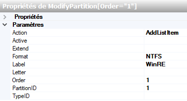
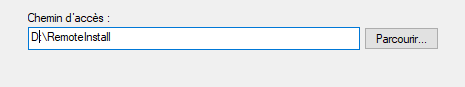
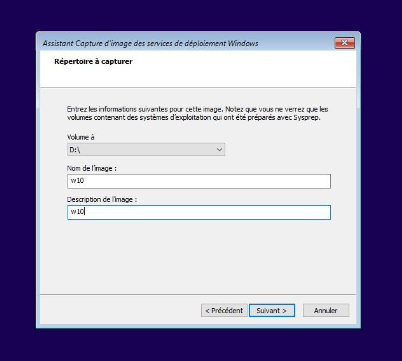

**Membre du groupe :**

**John Kassab -- Hugo Jacques -- Loick Odry**

**Vous trouverez en supplément la configuration du Windows Server en
tête de page**

**Configuration Windows Server**

Dans VMWare → Edit → Virtual Network Editor ⟶ passer Administrateur pour
gérer les cartes réseaux

Dans NAT, on décoche local DHCP car c'est nous qui allons le mettre en
place.

-   Subnet IP : 192.168.5.0 / 255.255.255.0

New Virtual Machine ⟶Custom ⟶install later ⟶Windows Server 2019 ⟶UEFI

1 & 4 processor config + 2048MB Ram

NAT → Store Virtual Disk as SF → 200GB

Delete printer ⟶ placer l'OS dans le CD/DVD

Datacenter Bureau

Personnaliser ⟶ On split 200 GB / 2

Install VMWare Tools ⟶ Typique

Ouvrir les paramètres réseaux ⟶ Protocole IPv4

-   Adresse IP : 192.168.5.11

-   Sous réseau : Auto

-   Passerelle : 192.168.5.2 (serveur DNS préféré)

On ping pour vérifier que l'on a bien Internet

On met à jour Windows Update

On renomme le poste : SRV-WIN2019

On update tout et on fait une snapshot après maj et VM éteinte.

**Rôle de serveur ADDS**

Config de déploiement → Ajouter une nouvelle forêt → nom de domaine
racine : **contoso.adds**

Nouveau fctnl de la forêt → Win Serv 2016

Domaine → idem

**Ne pas cocher délégation DNS**

Mdp : Passw0rd

Nom de domaine Netbios : CONTOSO

Gestion disque → changer D en E dans le gestionnaire de disque et faire
un nouveau volume avec la partie non utilisé et mettre le volume D au
format NTFS.

Nom du volume : Data

Dossier de la BDD et des fichiers journaux : *D:\\ADDS\\NTDS*

Dossier SYSVOL : *D:\\ADDS\\SYSVOL*

On vérifie la config générale puis on installe

**Rôle DHCP**

Nouvelle étendu : 192.168.5.101-110

Plan ip → 101 à 110

Plage d'exclusion : 101 à 110

Passerelle : 192.168.5.2

DNS : 192.168.5.2 / contoso.adds

Réserver une IP par adresse MAC en 192.168.5.101 pour le poste client

Ajouter des rôles de serveur→ Serveur DHCP

-   Fonctionnalités : rien

-   Terminer config DHCP

Nom d'utilisateur : on laisse contoso admin puis on se rend dans :

Outils → DHCP → Clic droit sur IPv4 → Nouvelle étendu :

-   Nom : Etendu-192.168.5.101-110

-   192.168.5.101 / 192.168.5.110 en fin

-   Ajout d'exclusion : 101 à 110

-   Durée du bail : 8 jours

-   Passerelle : 192.168.5.2

-   Nom du domaine et serv DNS : 192.168.5.11

-   Serveur WinS : on oublie

-   Activer l'étendue

Reservation → Nouvelle étendue → PCclient1

-   Adresse IP : 192.168.5.101

-   Adresse MAC : 123456789AB

-   Ajouter.

**Installation et mise en place de WDS**

**Gestionnaire de serveur -\> Gérer -\> Ajouter des rôles et
fonctionnalités** puis cocher **Services de déploiement Windows** et on
clique sur suivant jusqu'à arriver au bouton d'installation

Ensuite, on se rend dans **Outils → Service de déploiement Windows**

Clic droit sur notre **serveur → Configurer le serveur**

On choisit « **Intégré à Active Directory** » car ce serveur est membre
du domaine contoso.adds

On modifie le chemin d'accès du dossier d'installation de
*C:\\RemoteInstall* à *D:\\RemoteInstall.*

On ne change rien au paramètre du serveur DHCP proxy

Dans les paramètres initiaux du serveur PXE on choisit répondre
uniquement aux ordinateurs clients connus

En cas d'erreur de démarrage du service, on démarre manuellement :

On se rend dans **« Gestionnaire de serveur -→ Outils → Service de
déploiement Windows → Serveurs → *NotreServeur* -\> Image de démarrage →
Ajouter une image de démarrage ».**

On parcourt le disque et on y place le fichier **boot.wim** de l'ISO
Windows

Après ajout de l'image de démarrage on obtient ceci :

Nous allons mettre en place pour le déploiement, l'image d'installation
(**install.wim**). Pour cela il faut se munir des DVDs de Windows qui
serviront pour le déploiement.

Pour se faire on se rend dans **« Gestionnaire de serveur → Outils →
Sélectionnez Services de déploiement Windows → Serveurs → *NotreServeur*
→** Clique droit sur **Image d'installation → Ajouter un groupe
d'image »**

Clic droit sur le nom du groupe puis **« Ajouter une image
d'installation → Parcourir** puis on sélectionne le fichier
**« install.wim » → Suivant**

On choisit les images que l'on veut ajouter sur le serveur en les
cochant/décochant puis on termine l'opération.

Cliquez sur **Serveurs** → Faire un clic droit sur ***NotreServeur***. →
sélectionnez **Toutes les tâches** → sélectionnez **Démarrer**.

SI tout a correctement été exécuté, nous devrions obtenir ce message.

De plus, une flèche verte se met à côté du nom du serveur.

Dans Service de Déploiement Windows, on ajoute un nouvel ordinateur avec
l\'adresse MAC généré par VMWare dans NAT puis *avdanced* et enfin
adresse MAC

On crée un nouveau pc client dans Service de Déploiement Windows dans
périphérique de pré installe Active Directory

On donne un nom et dans ID de périphérique on met ladresse MAC sans les
« **:** »

Dans DHCP, dans réservations on ajoute une réservation avec une adresse
ip et l\'adresse MAC

Puis dans Utilisateur et ordinateurs Active Directory, on ajoute un
nouvel ordinateur et on remplit de 0 jusqu'à suivant

Pour vérifier que tout fonctionne, on se rend dans la VM sans image afin
de tester notre service WDS.

Une fenêtre s'ouvre et nous propos quel système d'exploitation à
installer.

Une fois le système d'exploitation choisi, on continue l'installation de
Windows de manière classique.

*Fin de l'installation et déploiement de WDS.*

Pour créer un fichier de réponse pour l'automatisation de Windows, on
doit tout d'abord installer ADK Manager :
<https://go.microsoft.com/fwlink/?linkid=2120254>

Lors de l'installation nous n'avons besoin que des outils de
déploiement :

On installe puis on ouvre l'outil

On extrait l'ISO Windows pour y récupérer le fichier **install.wim**

On se rend ensuite dans **ADK** → **Image Windows**. Sélectionner
l'image Windows et on recherche le fichier **install.wim**

ADK nous demande ensuite pour quelle version de Windows nous souhaitons
créer un fichier de réponse. Dans notre cas → Windows 10 Education N

**Ce dossier technique a pour but de créer 2 fichiers de réponses :**

1)  **Fichier de réponse boot → langue / disque / compte / choix ISO /
    login**

2)  **Fichier de réponse install → OOBE**

Fichier de réponse boot.xml

Tous les paramètres seront à ajoutés à la passe 1 WindowsPE :

-   International Core nous permet de choisir la langue du système

-   Windows Setup nous permet de gérer le partionnement des disques : on
    ajoute donc 4 *CreatePartitions* et 4 *ModifyPartitions*

On ajoute ***UserData*** avec en paramètre ***ProductKey*** à Setup
Neutral

La clé de license a été généré avec Azure

-   On ajoute le service de déploiement Windows qui permet de définir
    quel ISO installer et sur quel disque l'installer

On installe donc l'ISO Windows 10 Education N sur le disque ID 0 (se
référer à l'ID du *DIskConfiguration*) et sur la partition n°4

-   Vu que nous appartenons au domaine contoso, nous allons aussi
    automatiser la partie d'identification

On ajoute *Login* à Windows Setup :

Notre boot.xml est terminé, on le sauvegarde, on le placera plus tard en
même temps que le fichier de réponse install.xml

Fichier de réponses install.xml

Tous les paramètres présentés devront être ajoutés à la partie 7
*oobeSystem*

On définit un mot de passe de son choix dans *Password* puis *Value*

On définit un mot de passe de son choix dans *Password* puis *Value*

Nous avons désormais terminé nos 2 fichiers de réponses.

On déplace nos fichiers de réponses xml dans le dossier
**R*emoteInstall/WdsClientUnattend*** de notre serveur.

Pour les déployer, on se rend sur notre serveur Windows → **Outils** →
**Service de déploiement Windows**

Clic droit sur notre serveur → **Propriétés** puis on se rend dans
l'onglet **Client**.

Dans Architecture 64x UEFI on sélectionne notre fichier de réponse
**boot.xml**

Pour le fichier de réponses install.xml, on se rend dans le dossier
image d'installation, on double clique sur notre groupe d'image puis on
sélectionne l'ISO sur lequel on veut appliquer le fichier de réponse

Clic droit sur l'ISO puis enfin Propriétés, on coche « autoriser l'image
à s'installer en mode sans assistance » puis on y place le fichier de
réponse **install.xml**

Les fichiers de réponses sont terminés et déployés, la prochaine
installation de Windows se fera de manière automatisée sans la moindre
interaction demandée de la part de l'utilisateur

**Capture d'une image Windows**

Nous allons voir comment capturer Windows avec une image de capture sur
le service WDS.

Avant d'effectuer la capture du poste, le système d'exploitation doit
avoir été préparé à l'aide de l'utilitaire sysprep.

L'image de capture doit être activée sur le serveur WDS.

Avant toute chose, nous devons installer le rôle « **service de
déploiement Windows **»

On doit tout d'abord configurer notre serveur :

Le service PXE doit répondre à tous les clients mêmes inconnus. Si l'on
souhaite approuver et même nommer des clients inconnus, il faut cocher
la case exiger l'approbation de l'administrateur

Le service WDS est configuré, il reste à le démarrer manuellement

-   CREATION DES IMAGES DE DEMARRAGE ET CAPTURE

 Image de démarrage → Ajouter une image de démarrage

On fournit comme image de démarrage le fichier **boot.wim** contenu dans
l'iso du DVD de Windows 10 Education

On renomme pour indiquer clairement qu'il s'agit d'une image de boot, et
de quelle version de Windows elle est issue.

L'image sera stockée dans D:\\RemoteInstall\\Boot\\x64\\images.Une fois
l'image de boot créée, on passe à l'image de capture, que l'on crée à
partir de cette image de démarrage

On définit un nom de l'image et un fichier temporaire ou l'image sera
créée, avant qu'elle ne soit copiée dans le dossier WDS.

A partir de ce moment, on peut démarrer une station sur le boot PXE
(F12) pour vérifier que le DHCP attribue une adresse, et que le serveur
WDS prend le relais pour proposer de démarrer un déploiement ou une
capture

Pour déployer une image, on crée d'abord un groupe d'image, avant
d'ajouter l'image elle-même.

Dans un 1^er^ temps, on va ajouter une image issue du DVD original de
Windows 10, à savoir le fichier **install.wim**

Clic droit sur notre image d'installation → Ajouter une image
d'installation

On choisit l'image souhaitée parmi celles contenues dans le fichier .wim
(il peut y en avoir plusieurs\...)

L'image apparaitra après avoir cliqué sur le bouton Terminer. Cette
image permet de déployer un système d'exploitation vierge de toute
modification.

Nous allons à présent préparer et capturer une image en vue d'un
déploiement.

On se rend donc dans notre VM Client qui appartient au serveur puis on
exécute le programme **sysprep**

On entre en mode OOBE et on fait attention à arrêter le système

Une fois arrêté, la station est prête à la capture cependant il ne faut
pas la redémarrer tant que le serveur WDS n'est pas prêt à installer.

Dans les services de déploiement Windows, clic droit pour créer un
groupe d'images

On peut alors démarrer la station avec un F12 de manière à faire un boot
PXE.

On choisit comme image de boot non pas celle qui permet de déployer,
mais celle qui permet de capturer.

Une fois booté, on arrive sur un assistant qui va nous permettre de
capturer une image d'installation. On choisit le volume, le nom de
l'image ainsi qu'une description.

L'image va d'abord être enregistrée localement dans un dossier que l'on
peut préciser avec *Parcourir*\...

On coche impérativement « Télécharger l'image sur un serveur » puis on y
renseigne le nom complet (SRV-WIN2019) ou son adresse IP puis on clique
sur Connexion.

Une fois la liaison établie, on peut choisir le groupe d'image

La capture se lance et prend généralement entre 15 et 30 minutes.

L'image est alors disponible dans WDS, dans le groupe indiqué lors de la
capture.

Image d'installation → W10_Captured → w10

L'image se présent sous la forme de 2 fichiers dans le dossier
RemoteInstall.

A partir de ce point, notre serveur WDS est donc capable de faire booter
nos PC Client en mode PXE (grâce au rôle DHCP qui est installé sur le
même serveur que le WDS), capturer une image d'un système
« **sysprepé** » et de déployer cette image sur d'autres machines.

Problèmes rencontrés :

Après avoir utilisé 3x sysprep sur une même machine (étant donné que
nous n'avions jamais utilisé cet outil, nous étions obligé de faire
plusieurs tests), sysprep devient indisponible

Ce tutoriel nous a permis à corriger ce problème :
<https://www.tutos.eu/7090>
